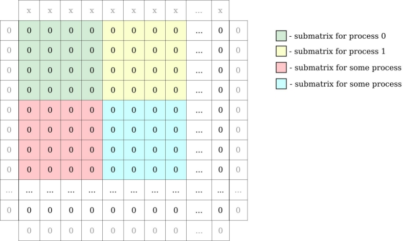
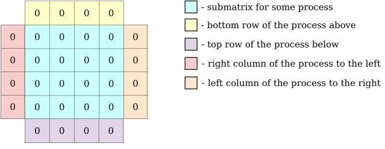
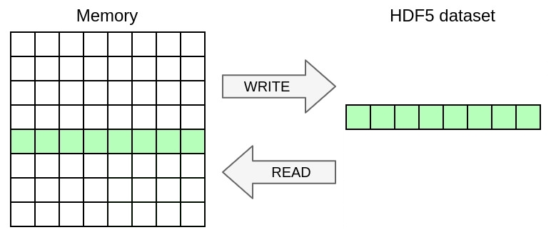
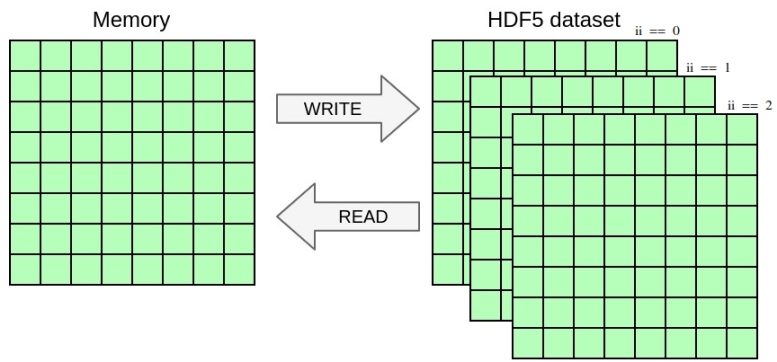
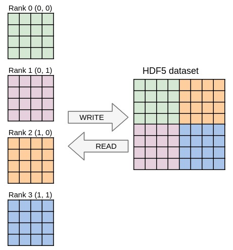
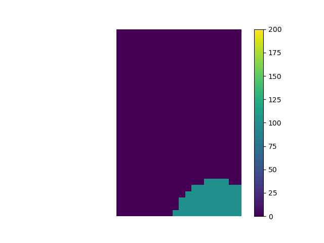
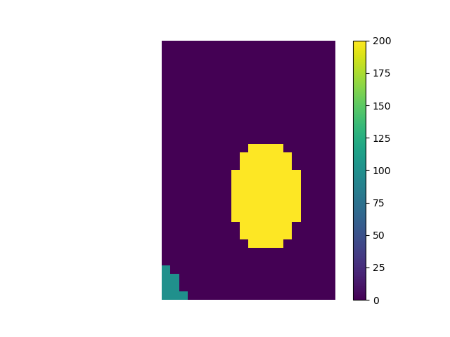
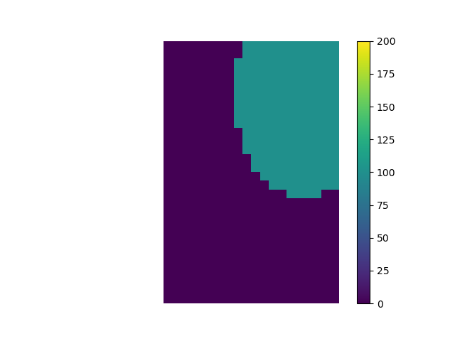
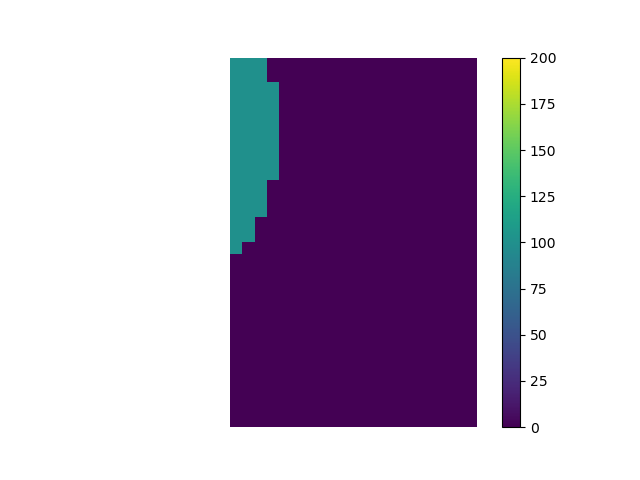

# Decoupling I/O in HPC Codes with PDI: From File-based I/O to In Situ Data Analytics

## [TO BE COMPLETED] Prepare the tutorial material

### Docker environment

Download [Docker Desktop](https://www.docker.com/products/docker-desktop/)

Get the docker image.

Get the sources from GitHub and set up the environment:

```bash
git clone -b tutorial_HPCAsia https://github.com/pdidev/tutorial.git 
cd tutorial 
source ./spack_env/bootstrap_env.sh 
```

You may test that your environment is properly set up using the dedicated script:

```bash
./environment_check_script
[...]
[0] SUCCESS 
[1] SUCCESS
[2] SUCCESS
[3] SUCCESS
```

### API used in this tutorial

```C
PDI_status_t PDI_init(PC_tree_t conf) 
PDI_status_t PDI_finalize(PC_tree_t conf) 

PDI_status_t PDI_share(const char *name, const void *data, PDI_inout_t access)
PDI_status_t PDI_reclaim(const char *name)  

PDI_status_t PDI_expose(const char *name, const void *data, PDI_inout_t access) 
PDI_status_t PDI_multi_expose(const char *event_name, const char *name, 
                              const void *data, PDI_inout_t access, …) 

PDI_status_t PDI_access(const char *name, void **data, PDI_inout_t access) 
PDI_status_t PDI_release(const char *name)
```

## HPCAsia PDI tutorial webpage

[https://pdi.dev/hpcasia26](https://pdi.dev/hpcasia26)

## PDI official webpage

[https://pdi.dev](https://pdi.dev)

## PDI official GitHub repo

[https://github.com/pdidev/pdi/](https://github.com/pdidev/pdi/)

## PDI Slack channel

[https://pdidev.slack.com/](https://pdidev.slack.com/)

## Acknowledge

As part of the "France 2030" initiative, this work has benefited from a State grant managed by the French National Research Agency (Agence Nationale de la Recherche) attributed to the Exa-DoST project of the NumPEx PEPR program, reference: ANR-22-EXNU-0004.

Part of the research presented here has received funding from the Horizon 2020 (H2020) funding framework under grant/award number: 676629 (EoCoE) and 824158 (EoCoE-II). The present publication reflects only the authors views. The European Commission is not liable for any use that might be made of the information contained therein.

## PDI HANDS-ON

* The main program implements a simple heat equation solver using an explicit forward finite difference scheme parallelized with MPI. The code uses a block domain decomposition where each process holds a 2D block of data.

  
  
  Locally, each process holds its local block of data with one additional element on each side for ghost zones.

  

* In the following exercises however, PDI will only be used to decouple I/O operations. There is no need to fully dive in the core of the solver implemented in the `iter` and `exchange` functions.
* The specification tree in the `config.yml` files and the `main` function are the locations where all the I/O-related aspects will be handled and the only ones you will actually need to fully understand or modify.
* Variables used in `main.c`:  
  * `int dsize[2]`:  size of the local data as `[HEIGHT, WIDTH]`, including the number of ghost layers  
  * `int psize[2]`: 2D size of the process grid as `[HEIGHT, WIDTH]`
  * `double **cur`: local data, of size `[dsize[0],dsize[1]]`, representing the temperature  
* `config.yml`:  
  * This file is used to set the simulation parameters.

      ```C
      PC_tree_t conf = PC_parse_path("config.yml"); 
      ```

  * We will also use this file to configure PDI.  
  * The parameter is passed to the simulation using:

    ```C
    long longval; 
    PC_int(PC_get(conf, ".parallelism.height"), &longval); 
    psize[0] = longval; 
    ```

* Compile and run the test using:

   ```bash
   cmake -B build
   cmake --build build
   mpirun -np 4 ./main 
   ```

* There is no input/output operations in the code yet, so you can not see any result.
* If you're not familiar with YAML, please have a look at our quick [YAML format](https://pdi.dev/main/YAML.html) to understand it. The example uses the [paraconf library](https://github.com/pdidev/paraconf) to read this file.

## [00_begin] Instrument the simulation with PDI

* Include the PDI header file `<pdi.h>` and initialize the PDI environment with:

   ```C
   PDI_init(PC_get(conf, ".pdi")); 
   PDI_finalize();
   ```

* Add a PDI section in `config.yml`  

   ```yaml
   pdi:
   ```

   The sub-tree, defined after this `.pdi` key, is the PDI specification tree passed to PDI at initialization.

* Modify the `CMakeLists.txt` to link the executable with PDI

   ```cmake
   find_package(PDI 1.9.0 REQUIRED COMPONENTS C) 
   target_link_libraries(main m MPI::MPI_C paraconf::paraconf PDI::pdi)
   ```

* You should obtain the output as:  

   ```text
   [PDI] *** warning: Data is not defined in specification tree 
   [PDI] *** info: Initialization successful 
   [PDI] *** warning: Data is not defined in specification tree 
   [PDI] *** info: Initialization successful 
   [PDI] *** warning: Data is not defined in specification tree 
   [PDI] *** info: Initialization successful 
   [PDI] *** warning: Data is not defined in specification tree 
   [PDI] *** info: Initialization successful 
   [PDI] *** info: Finalization 
   [PDI] *** info: Finalization 
   [PDI] *** info: Finalization 
   [PDI] *** info: Finalization 
   [1] SUCCESS 
   [3] SUCCESS  
   [0] SUCCESS 
   [2] SUCCESS
   ```

   Additionally, we can run sequentially to facilitate the comparison between logs (in parallel each rank send a `trace` message and the order of writing can be different).

* The warning states that no data definition can be found for PDI's configuration. We shall add some data to PDI in the next step.

## [01_trace] Use the trace plugin to observe the data movement in the PDI data_store

* Use `PDI_expose` to make buffers available by PDI.

   ```C
   PDI_expose("local_size", dsize, PDI_OUT);
   ```

* Expose to PDI before the temporal loop, the variable `dsize` with the name  `local_size`, and set it as PDI `metadata`:

   ```yaml
   metadata: 
     local_size: {type: array, subtype: int, size: 2}
   ```

* By definition, a `metadata` is a variable that can be used to describe other data (for example, the size of a vector). You can reference them from dynamic `$-expressions` in the configuration file.
  
* Expose at the beginning of each iteration, and at the end of the temporal loop, the variable `ii` with the name `iteration`, and `cur` with the name `temp`. Set `temp` as PDI data:  

   ```yaml
   data:
     temp: {type: array, subtype: double, size: ['$local_size[0]', '$local_size[1]']}
   ```
  
  Unlike the other fields manipulated until now, the type of `temp` is not fully known: its size is dynamic. Therefore, we need to define the `local_size` in YAML file in advance for PDI using `$-expressions`.

* A definition of `metadata` and `data` can be:
  * `metadata`: small values for which PDI keeps a copy. These value can be referenced by using `$-expressions` in the configuration YAML file.
  * `data` : values for which PDI does not keep a copy.

* Use the trace plugin:

   ```yaml
   plugins:
     trace:
       logging: {pattern: '[PDI][%n-plugin] *** %l: %v' }
   ```

* Limit the max iterations to 3

   ```C
   int max_iter = 3;
   ```

* and set use 1 process MPI
  
   ```yaml
   parallelism: { height: 1, width: 1 }
   ```

* Run the test and compare the output with the reference `trace_reference.txt`

* `PDI_expose` is actually a consecutive call of two PDI functions:

   ```C
   PDI_expose("local_size", dsize, PDI_OUT);
   // is equivalent to
   PDI_share("local_size", dsize, PDI_OUT); 
   PDI_reclaim("local_size");
   ```

* In some cases, you may want to overlap IO operations with computes. To do so, you can rely on the `PDI_share` and `PDI_reclaim` calls.

   ```C
   PDI_share("my_data", data, PDI_OUT); 
   // after PDI_share, the data buffer is available for PDI plugins
   // while PDI plugins are performing operations on the data buffer for IO, 
   // simulation is free to :
   //     read the data buffer
   //     perform other computations
   PDI_reclaim("my_data");
   // simulation get back the control of data buffer
   ```

* You can replace `PDI_expose` with `share+reclaim` and observe the trace results.

## [03_hdf5_A] Use HDF5 to save the simulation data to disk sequentially

* Activate the `decl_hdf5` plugin with:

   ```yaml
   plugins:   
     decl_hdf5:     
       - file: output_rank${rank:01}_iter${iteration:02}.h5              
         write:         
           temp:
           iteration:
   ```

* Several attributes are necessary for this exercise with HDF5 plugin:  
  * `file`: name of the output file. This can be a mix of string and `(meta)data $-expression`.  
  <!-- * Similar to the Pycall plugin, we chose to trigger the HDF5 plugin with the `on_event` method.   -->
  * Use the `write` keyword to specify the content to write in a list  

  In order to use `rank` for naming the file, you need to expose it with PDI in advance. Declare the `rank` as `metadata` in `config.yml` so you can reference its value.

* **warning** If you relaunch the executable `./main`, remember to delete your old `.h5` files before, otherwise the data will not be changed.
  This behavior can be configured with `collision_policy` atrtibute under the `file` specification tree.
  A COLLISION_POLICY is a string that identifies what to do when writing to a file or dataset that already exists. Available policies are listed below:

  * `skip` - do not do anything
  * `skip_and_warn` - do not do anything, only generate a warning message
  * `error` - do not do anything, only throw an error
  * `write_into` - [default] write into the existing file/dataset (potentially overwriting existing data in it)
  * `write_into_and_warn` - write into the existing file/dataset (potentially overwriting existing data in it) and generate a warning message
  * `replace` - delete the existing file/dataset and create a new one
  * `replace_and_warn` - delete the existing file/dataset, create a new one, but generate a warning message

* Try to generate some output files and check the data size with

   ```bash
   mpirun -np 4 ./main
   h5dump -A output_rank0_iter00.h5
   ```
  
  And you should have something similar to:

   ```text
   GROUP "/" {
      DATASET "temp" {
         DATATYPE  H5T_IEEE_F64LE      
         DATASPACE  SIMPLE { ( 32, 22 ) / ( 32, 22 ) }    
      } 
   } 
   ```

* The size (32,22) corresponds to the local size with 2 ghost layers. Now, we will remove the ghost layers in our output data using `memory_selection`, which allows us to make a selection on the data passed to PDI from the simulation.
  
  

   ```yaml
   write:   
     temp:
       memory_selection:
         size: [ '$local_size[0]-2', '$local_size[1]-2' ]        
         start: [1, 1]
   ```

* Add the selection to the `config.yml` and run the test. You should encounter an error at runtime:

   ```bash
   [PDI] *** error: Error while triggering event `loop`: 
   Config_error: Incompatible selections while writing `temp': [ (1-30/0-31) (1-20/0-21) ] -> [ (0-31/0-31) (0-21/0-21) ] |
   ```

  This error indicates that we have a size issue with our data. Each time the HDF5 plugin writes data to a file, if the HDF5 dataset is not defined explicitly, it uses the default dataset, which has the same size as the declared data. You can use the datasets attribute in order to specify the dataset in which the data will be written:

   ```yaml
   - file: output_rank${rank:01}_iter${iteration:02}.h5   
     datasets:     
       temp: { type: array, subtype: double, size: ['$local_size[0]-2', '$local_size[1]-2']}
   ```

* Note: you are not obliged to name the dataset the same name as the data. However, if you give a different name to the dataset (e.g., `temp_ds`), then you need to mention it explicitly in `config.yml`:

   ```yaml
   write:
     temp:
       dataset: temp_ds
   ```

* Now re-run the test, and the error should have disappeared.

* BONUS. Let's go a little bit further to optimise the file writing with HDF5. In the current state, two varaibles are outputted to file. What is actully called inside the decl_hdf5 plugin is:

  * `PDI_expose("iteration")` -> create/open `.h5` file -> write the content of `iteration` to file -> close the file
  * `PDI_expose("temp")` -> create/open `.h5` file -> write the content of `temp` to file -> close the file

  The output file is indeed opened twice and closed twice in this scenario. However, we would like to open the file once, put all necessary content, and then close the file. We can achieve this with the `event` mechanism in PDI. By adding the `event ` key word to the `config.yml`, we notify the plugin that the writing process can not begin unless the event `loop` is issued.

   ```yaml
   on_event: loop
     write:
       iteration: 
       temp:
  ```
  
  On the simulation side, we shall use the `PDI_multi_expose` function to trigger an event and to expose buffers to PDI.

* Similarly to `PDI_expose`, the `PDI_multi_expose` is implemented with interlaced share/reclaim pairs.

   ```C
   PDI_multi_expose("loop", 
                    "iteration", &ii, PDI_OUT, 
                    "temp", cur, PDI_OUT, 
                    NULL);
   // is equivalent to
   PDI_share("iteration", &ii, PDI_OUT); 
   PDI_share("temp", cur, PDI_OUT); 
   PDI_event("loop"); 
   PDI_reclaim("temp"); 
   PDI_reclaim("local_size");
   ```

   When we used `PDI_multi_expose` with multiple data, the order of appearance of the arguments of the function corresponds to the order of the `PDI_share`. In a `PDI_multi_expose` if you have a `data1` that depends on the `data2`, you need to pass the arguments corresponding to `data2` before the arguments corresponding to `data1` in this function. With `PDI_share` and `PDI_reclaim` functions, you need to share `data2` before `data1`.
  For example, a vector `V` that depends on its size `N`:

   ```C
   PDI_multi_expose("save_vector_V",
                    "size_of_vector", &N, PDI_OUT,
                    "vector_V", V, PDI_OUT,
                    NULL);
   // is equivalent to
   PDI_share("size_of_vector", &N, PDI_OUT)
   PDI_share("vector_V", V, PDI_OUT)
   PDI_reclaim("vector_V")
   PDI_reclaim("size_of_vector")
   
   ```

## [03_hdf5_B] Use HDF5 to write selections in datasets

* In this exercise, we want to write all iterations in a single HDF5 dataset. To do so, you will once again change the `config.yml` to handle a selection in the dataset in addition to the selection in memory from the previous exercise.

* The objective is to write the 2D array from the previous exercise as a slice of 3D dataset including a dimension for time. Once again, you only need to modify the YAML file in this exercise, no need to touch the C file.

* As HDF5 does not allow an unlimited dimension, unlike netCDF, you need to expose to PDI the maximum number of iterations (`max_iter`) and let the HDF5 plugin acknowledge this information to reserve the correct memory space for the dataset.

* Modify the `datasets` to extend their dimension to 3 (one for the time dimension, and 2 for the space dimension).

* Similarly, modify the `dataset_selection` section to choose the correct size and start position to receive data from each MPI process.
  
  

## [03_hdf5_C] Use HDF5 to perform writing in parallel

* Running the code from the previous exercises in parallel should already work and yield one file per process containing the local data block. In this exercise you will write one single file (e.g. `output.h5`) with parallel HDF5 whose content should be independent from the number of processes used. Once again, you only need to modify the YAML file in this exercise, no need to touch the C file.

* To enable the parallel write with HDF5, we need to give it the context of the MPI communicator `MPI_COMM_WORLD` by activating the `MPI` plugin:  

   ```yaml
   plugins:   
     mpi:   
     decl_hdf5:     
     - file: output.h5   
       communicator: $MPI_COMM_WORLD
   ```

* Similar to the previous exercise, we need to specify the `datasets` used in the HDF5 output file. **Attention**, it is now the global size of the domain!

* Set the size of the dataset to take the global (parallel) array size into account. You will need to multiply the local size by the number of processes in each dimension (use `psize` and `local_size`).

* Ensure the dataset selection of each process does not overlap with the others. You will need to make a selection in the dataset that depends on the global coordinate of the local data block (use `pcoord`).

  

## [03_hdf5_D] Use regex in HDF5 to define dataset patterns

* This bonus section explains the use of the `regex` in the `decl_hdf5` plugin. This is a feature introduced in PDI 1.9.3 and later. The `regex` uses the Modified ECMAScript regular expression grammar.

* In this exercise, you will write a generic dataset pattern using regex. For example, each iteration data will be outputted in a dedicated group inside the unique file `output.h5`.

* For example, we would like to have:

   ```bash
   GROUP "/" {
      GROUP "iteration_00" {
         DATASET "temperature" {
            DATATYPE  H5T_IEEE_F64LE
            DATASPACE  SIMPLE { ( 60, 40 ) / ( 60, 40 ) }
            DATA {
            (0,0): ... 
            (0,20): ...
            ... 
            }
         }
      }
      GROUP "iteration_01" {
         DATASET "temperature" {
            DATATYPE  H5T_IEEE_F64LE
            DATASPACE  SIMPLE { ( 60, 40 ) / ( 60, 40 ) }
            DATA {
            (0,0): ... 
            (0,20): ...
            ... 
            }
         }
      }
      ...
   }
   ```

## [02_pycall] Use Pycall to generate partial images of the simulation

* We can use PDI to perform some in-situ analysis with the Pycall plugin, which allows you to call some Python scripts using the same process.
* In this exercise, we will generate simulation images using `matplotlib` from Python.  
<!-- * You need to share the variable pcoord with PDI to set up the output image name. It is already declared in the `config.yml` as `metadata`.   -->
* Several options are available to call the Python script. We will use the `on_event` trigger. You can then use `PDI_multi_expose` to share data and trigger an event.  

   ```C
   PDI_multi_expose("loop", 
                    "iteration", &ii, PDI_OUT,
                    "temp", cur, PDI_OUT,
                    NULL);
   ```

   ```yaml
   plugins:
     pycall:
      on_event:
         loop:
         with: # insert here your list of arguments       
         exec: | # insert your Python script below 
            [...]
   ```

* When passing arguments from PDI to Python, you can use:

   ```yaml
   with: { iter_id: $iteration}
   ```

  where `py_iter`, whose value is defined by `iteration`, can be used inside the Python environment.

* Here is an example of a Python script for generating the partial images without the ghost layer. You are free to do it differently.

   ```python
   import matplotlib.pyplot as plt 
   plt.imshow(source_field[1:-1, 1:-1], origin='lower', cmap='viridis', vmax=200) 
   plt.colorbar() 
   plt.axis('off') 
   plt.savefig("output_r"+str(py_pcoord[0])+"x"+str(py_pcoord[1])+"_iter"+ str(iter_id)) 
   plt.close()
   ```

* Below is an example of the partial images at iteration 0.  

| | |
|:-------------------------:|:-------------------------:|
|   |  |
|   |  |

* Note: It is also possible to generate global images via the pycall plugin. Please check in the solution folder.  


## [04_usercode] Use the user_code plugin to compute some numerical metrics

* While Pycall plugins calls Python scripts, the `user_code` plugin allows us to call a C function.  
* This C function takes no arguments, but it can access the content of variables available in the PDI data store.  
* In this exercise, we want to compute the sum of the temperature across the whole domain, and the result at each iteration will be written to a file.  
* To write to a file, we must open and close it properly. We choose to use the `on_event` trigger. We will trigger the initialization event before the temporal loop and a finalization event after it. Upon triggering of these events, a corresponding C function will be called to open and close the file.  

   ```yaml
   plugins:    
     user_code:      
       on_event: 
         initialization:
           open_file: {}
         finalization:
           close_file: {} 
   ```

* In `main.c` you need to implement routines for file opening and closing.

   ```C
   void open_file(void) {
      // … only rank 0 will perform 
   } 

   void close_file(void) {
      // … only rank 0 will perform 
   }
   ```

* Similarly, when the `loop` event is triggered, we will call the function `compute_integral`, which computes the integral.

   ```C
   void compute_integral(void) {   
      // get the MPI rank   
      // use PDI_access to get:
         // current iteration number
         // local grid size and the process grid size
         // current temperature field        
         // e.g.       
         // int *iter;       
         // PDI_access("iteration", (void**)&iter, PDI_IN);       
         // PDI_release("iteraion");       
         // use *iter as the value of the iteration number   
      // compute the local 2D sum of the field     
      // get the global sum using MPI_Allreduce   
      // use PDI_release to release the buffer   
      // rank 0 writes the result in the file 
   }
   ```

* You may also need to modify the `CMakeLists.txt`.

   ```cmake
   add_executable(main main.c) 
   target_link_libraries(main m MPI::MPI_C paraconf::paraconf PDI::pdi) 
   set_target_properties(main PROPERTIES ENABLE_EXPORTS TRUE)
   ```

* You can compare the results with `integral_reference.dat`.
